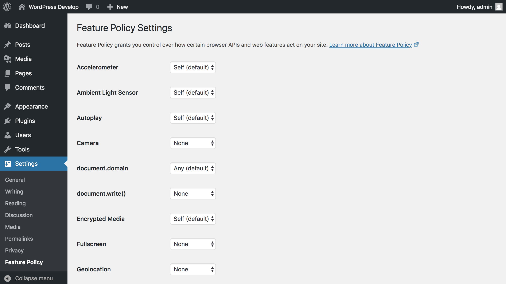

# Feature Policy

WordPress plugin for managing feature policy headers.

## Details

As [noted on the Google Developers blog](https://developers.google.com/web/updates/2018/06/feature-policy):

> Feature Policy allows web developers to selectively enable, disable, and modify the behavior of certain APIs and web features in the browser. **It's like CSP but instead of controlling security, it controls features!**
>
> The feature policies themselves are little opt-in agreements between developer and browser that can help foster our goals of building (and maintaining) high quality web apps.

This plugin provides an API for sending the `Feature-Policy` response headers, as well as an admin interface for deciding which policy to apply for each feature.

As the Feature Policy specification is still evolving and at an early stage, the plugin reflects that and is currently an experimental prototype, to demonstrate how Feature Policy can be used in WordPress.

### Did you know?

The Feature Policy specification will integrate with the new Reporting API specification. There is a [WordPress plugin for that specification](https://github.com/GoogleChromeLabs/wp-reporting-api) as well.

## Requirements

* WordPress >= 4.7
* PHP >= 5.6

## Contributing

Any kind of contributions to Feature Policy are welcome. Please [read the contributing guidelines](https://github.com/GoogleChromeLabs/wp-feature-policy/blob/master/CONTRIBUTING.md) to get started.

## Further Resources

* [https://featurepolicy.rocks/](https://featurepolicy.rocks/)
* [https://developers.google.com/web/updates/2018/06/feature-policy](https://developers.google.com/web/updates/2018/06/feature-policy)
* [https://developers.google.com/web/updates/2018/09/reportingapi](https://developers.google.com/web/updates/2018/09/reportingapi)
* [https://developer.mozilla.org/en-US/docs/Web/HTTP/Feature_Policy](https://developer.mozilla.org/en-US/docs/Web/HTTP/Feature_Policy)
* [https://wicg.github.io/feature-policy/](https://wicg.github.io/feature-policy/)
* [https://github.com/WICG/feature-policy](https://github.com/WICG/feature-policy)
